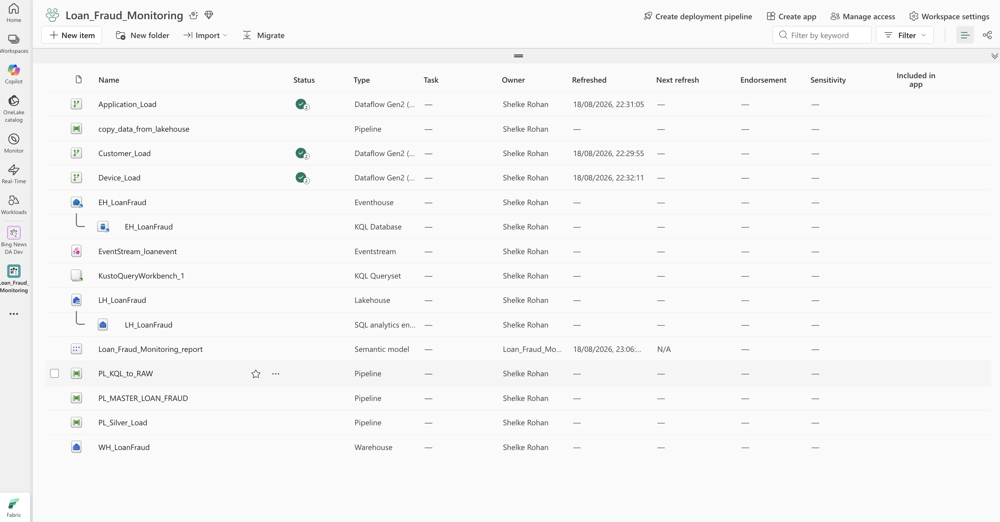
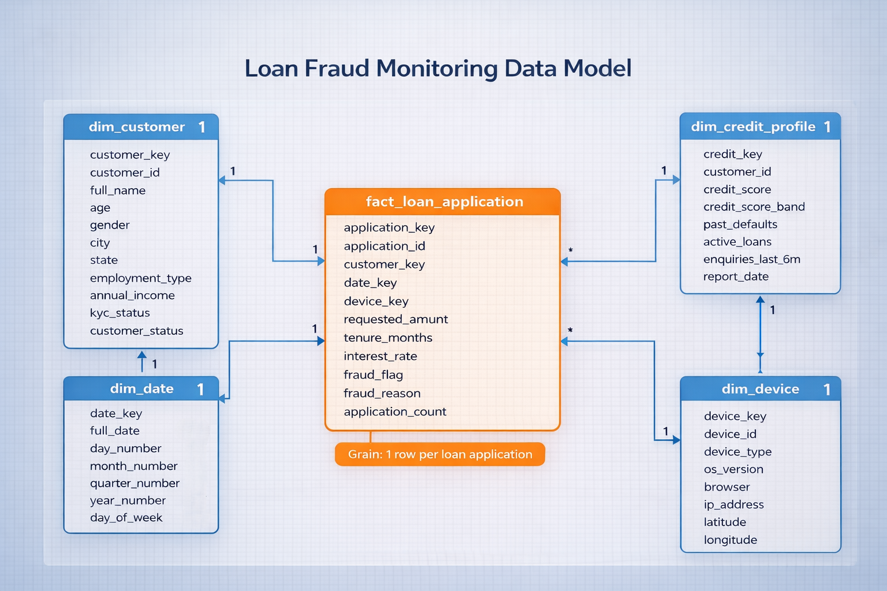
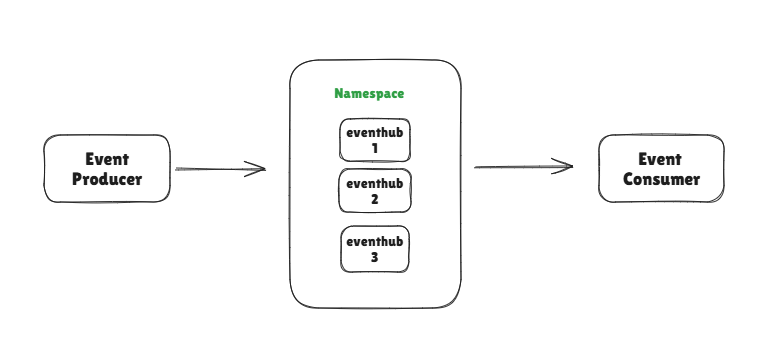
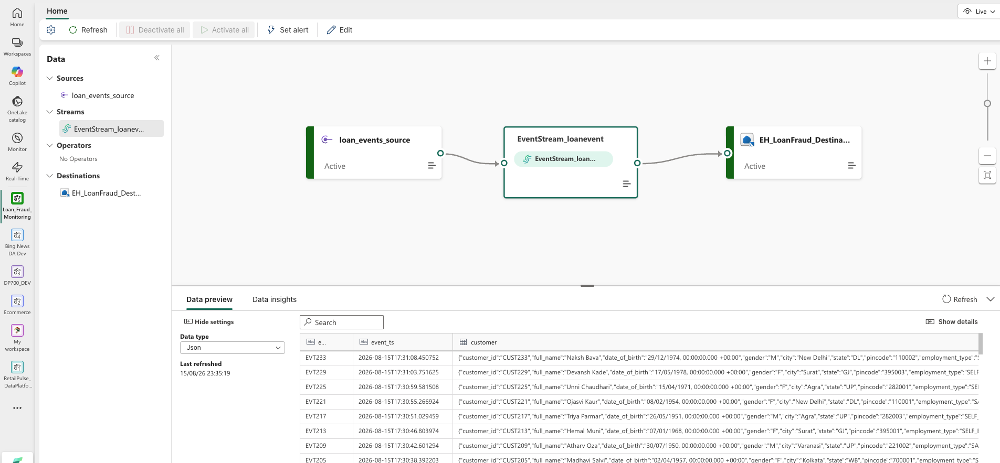
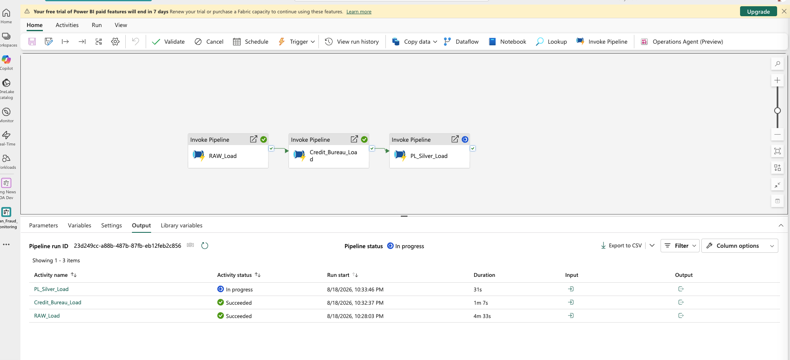
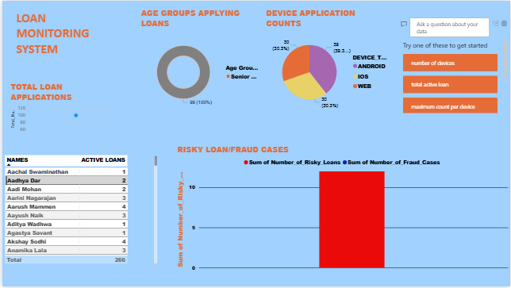
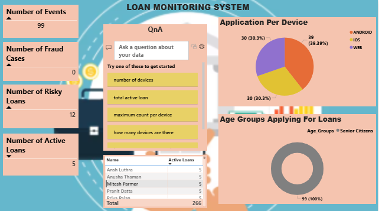

# Loan Fraud Monitoring — Real-Time Fabric Data Platform

## Overview
Banks receive loan applications (home, personal, vehicle, business, education) in real time from mobile apps and websites. This project ingests those applications as streaming events, enriches them with customer and credit bureau data, flags fraudulent/risky applications, and surfaces the results in a Power BI dashboard for management.

Built entirely on **Microsoft Fabric** — no external Azure subscription required (Eventstream's Custom App source replaces a standalone Azure Event Hub).

---

## Architecture

**Flow:** Mobile Apps / Websites → Fabric Eventstream (Custom App source) → EventStream → EventHouse (KQL Database, real-time fraud detection) → SQL Database → Dashboards. In parallel: KQL Database → Lakehouse → Medallion layers (Bronze = Raw Events, Silver = Enriched Features, Gold = Fraud Decisions).

---

## Data Model

Star schema, grain = 1 row per loan application:

| Table | Type | Key Columns |
|---|---|---|
| `fact_loan_application` | Fact | application_key, customer_key, date_key, device_key, credit_key, requested_amount, tenure_months, interest_rate, fraud_flag, fraud_reason |
| `dim_customer` | Dimension (SCD) | customer_key, customer_id, full_name, age, gender, city, state, employment_type, annual_income, kyc_status, is_current |
| `dim_date` | Dimension | date_key, full_date, month/quarter/year |
| `dim_device` | Dimension | device_key, device_id, device_type, os_version, browser, ip_address, lat/long |
| `dim_credit_profile` | Dimension | credit_key, customer_id, credit_score, credit_score_band, past_defaults, active_loans, enquiries_last_6m |

---

## Event Hub Concepts (Reference)
See `Evnthub_Basics.md` for definitions of Producer, Consumer, and Namespace.

*Producer → Namespace (grouping multiple Event Hubs) → Consumer.*

---

## Tech Stack
- **Ingestion:** Fabric Eventstream (Custom App / Event Hub-compatible endpoint), Python (`azure-eventhub`, `faker`) event generator
- **Real-time store:** Fabric Eventhouse / KQL Database
- **Storage:** Fabric Lakehouse (for CSV batch source), Fabric Warehouse (STAGE / BUSINESS / VIEW_LAYER schemas)
- **Orchestration:** Fabric Data Pipelines (Copy Data, Dataflow Gen2, Script activities)
- **Transformation:** T-SQL (MERGE/INSERT), KQL
- **Reporting:** Power BI (`Report2.pbix`)

---

## Repository Contents

| File | Purpose |
|---|---|
| `Architecture_Loan_Fraud_Monitoring.PNG` / `image-6.png` | End-to-end architecture diagram |
| `Data_Model_Loan_Fraud.png` | Star schema diagram |
| `Evnthub_Basics.md` | Event Hub concepts (Producer/Consumer/Namespace) reference |
| `image-7.png` | Diagram illustrating Producer → Namespace → Consumer |
| `requirements.txt` | Python dependencies (`faker`, `azure-eventhub`) |
| `test.py` | Local dry-run event generator (no live send, prints JSON only) |
| `script_to_load_EventStream.py` | Production event generator — streams JSON events into Fabric Eventstream |
| `KQL_Queries.kql` | Validation queries against `Ingestion_table` in the Eventhouse |
| `CREDIT_BUREAU_Source_File.csv` | Daily batch credit bureau feed (loaded via Lakehouse + Copy Data) |
| `image-1.png` | Screenshot: Copy Data pipeline (`copy_data_from_lakehouse`) loading the credit bureau CSV |
| `image.png` | Screenshot: Dataflow pipeline (`Customer_Load` → `Application_Load` → `Device_Load`) moving KQL DB data into RAW |
| `Stage_Tables_DDLs.sql` | Creates `STAGE` schema: `STG_CUSTOMER`, `STG_LOAN_APPLICATION`, `STG_APPLICATION_DEVICE`, `STG_CREDIT_BUREAU` |
| `image-3.png` | Screenshot: Script activity ("Silver Data Loading") — RAW → SILVER pipeline |
| `Business_Table_DDLs.sql` | Creates `BUSINESS` schema: dimension and fact tables |
| `business_tables_loading.sql` | MERGE/INSERT logic: STAGE → BUSINESS (dims, then fact with fraud rules) |
| `image-2.png` | Screenshot: `Gold_Layer.sql` view-creation script (SILVER → GOLD) |
| `Gold_Layer.sql` | Creates `VIEW_LAYER` schema with 5 reporting views |
| `Report2.pbix` | Power BI report file connected to `VIEW_LAYER` |
| `image-4.png` | Screenshot: Power BI report page 1 (Total Applications, Age Groups, Device Counts, Risky/Fraud bar, Active Loans table) |
| `image-5.png` | Screenshot: Power BI report page 2 (Events/Fraud/Risky/Active KPI cards, Application per Device, Age Groups, Q&A visual) |
| `Upper.py` | Utility script to uppercase a file's contents (optional, not part of core pipeline) |

---

## End-to-End Build Steps

### 1. Event Generation
- Install dependencies: `pip install -r requirements.txt`.
- Validate event shape locally with `test.py`.
- Configure `CONNECTION_STR` and `EVENT_HUB_NAME` (from Fabric Eventstream's Custom App source) in `script_to_load_EventStream.py`, then run it to stream events.

### 2. Real-Time Ingestion
- In Fabric: **Eventstream** → source = Custom App → destination = Eventhouse (KQL Database), landing table `Ingestion_table`.
- Validate with `KQL_Queries.kql` (`take`, `project`, `count`).

### 3. Credit Bureau Batch Load
- Upload `CREDIT_BUREAU_Source_File.csv` to a **Lakehouse**.
- Data Pipeline **Copy Data** activity (see `image-1.png`) → loads into `STAGE.STG_CREDIT_BUREAU`. Note: source CSV header is `CUST_OMER_ID` — map explicitly to `CUSTOMER_ID`.

### 4. RAW Layer (Bronze)
- Run `Stage_Tables_DDLs.sql` to create the `STAGE` schema.
- Data Pipeline with chained **Dataflow Gen2** activities (see `image.png`: `Customer_Load` → `Application_Load` → `Device_Load`) move data from `Ingestion_table` into the STAGE tables.

### 5. Silver / Business Layer
- Run `Business_Table_DDLs.sql` to create the `BUSINESS` schema.
- Data Pipeline **Script** activity (see `image-3.png`, "Silver Data Loading") runs `business_tables_loading.sql`:
  1. MERGE → `DIM_CUSTOMER`
  2. MERGE → `DIM_CREDIT_PROFILE` (computes credit score band)
  3. MERGE → `DIM_DEVICE`
  4. INSERT → `FACT_LOAN_APPLICATION` (joins all dims, computes `fraud_flag`/`fraud_reason`)

### 6. Gold / View Layer
- Run `Gold_Layer.sql` (see `image-2.png`) to create `VIEW_LAYER` with:
  - `VW_LOAN_APPLICATIONS_BY_DEVICE`
  - `VW_CUSTOMER_ACTIVE_LOANS`
  - `VW_LOAN_FRAUD_DETECTION_SUMMARY`
  - `VW_RISKY_LOAN_APPLICATIONS`
  - `VW_LOAN_APPLICATIONS_BY_AGE_GROUP`

### 7. Reporting
- Connect `Report2.pbix` to the `VIEW_LAYER` views via the Warehouse SQL endpoint.
- Build/verify visuals against `image-4.png` and `image-5.png` reference pages.
- Publish to the Fabric workspace.

### 8. Orchestration
- Combine Steps 3–5 pipelines into one master pipeline with a **Schedule trigger** (e.g. daily) so STAGE → BUSINESS refresh automatically. Gold views don't need re-running (they read live from BUSINESS tables).

---

## Fraud Detection Logic
Applied in `business_tables_loading.sql` at fact-load time:

| Condition | Result |
|---|---|
| `credit_score < 600` | `fraud_flag = 1`, reason = "Low Credit Score" |
| `requested_amount > 10,00,000` | `fraud_flag = 1`, reason = "High Loan Amount" |
| `channel = 'WEB'` and `device_type = 'UNKNOWN'` | `fraud_flag = 1` |
| Otherwise | `fraud_flag = 0` (genuine) |

---

## Known Issues / To-Do
- **SCD bug:** In `business_tables_loading.sql`, the `DIM_CUSTOMER` MERGE sets `is_current = 0` on every matched update but never inserts a new current row or closes `EFFECTIVE_TO` on the old one — history tracking is broken. Fix before relying on `is_current` in reporting.
- **Throughput:** On smaller Fabric capacities, the Custom App Eventstream source may throttle under `script_to_load_EventStream.py`'s full 150,000-event run — reduce the loop range or increase `time.sleep()` if this happens.
- **CSV header mismatch:** `CREDIT_BUREAU_Source_File.csv` has header `CUST_OMER_ID` — must be explicitly mapped to `CUSTOMER_ID` in the Copy Data activity; don't rely on auto-mapping.

---

## Dashboard Highlights

- Total Loan Applications, Active Loans, Fraud Cases, Risky Loans (KPI cards)
- Applications by Device Type (pie)
- Age Group distribution (donut)
- Risky Loan / Fraud Cases (bar chart)
- Active Loans by Customer (table)
- Natural-language Q&A visual
